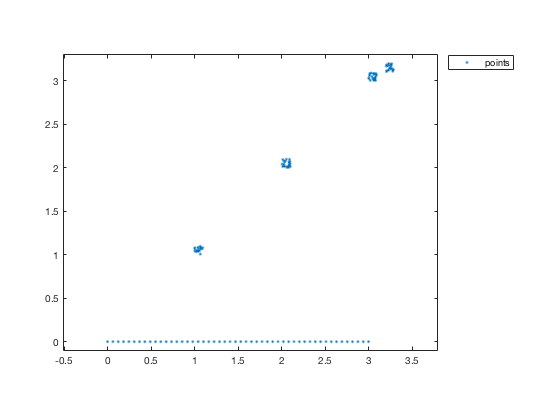
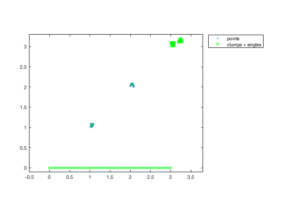
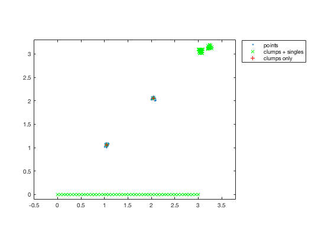

# findclump.m: Locate clumps of points in space


Author: Kelly Kearney


This repository includes the code for the `findclump.m` Matlab function, along with all dependent functions required to run it.


This function finds groups, or "clumps",  of data points, defined as points that are all within a certain distance of each other and not within that distance to any other points in the dataset.


## Contents


- Getting started        
- Syntax        
- Examples        
- Contributions

## Getting started


**Prerequisites**


This function requires Matlab R14 or later.


**Downloading and installation**


This code can be downloaded from [Github](https://github.com/kakearney/findclump-pkg/) or the [MatlabCentral File Exchange](http://www.mathworks.com/matlabcentral/fileexchange/xxxx-example).  The File Exchange entry is updated daily from the GitHub repository.


**Matlab Search Path**


The following folders need to be added to your Matlab Search path (via `addpath`, `pathtool`, etc.):


```matlab
findclump-pkg/InterPointDistanceMatrix
findclump-pkg/findclump
```


## Syntax


```
[xc, ix] = findclump(x, tol, metric)
```


Input variables:


- `x`: n x m array of data points, where each row represents one m-dimensional point
- `tol`: tolerance distance
- `metric`: distance metric to use for interpoint distance calculation:             1 = city block, 2 = Euclidean (default), inf = infinity-norm, 0             = minimum difference.  See `help ipdm` for more details.

See `help finclump` for full description of input and output variables.


## Examples


Let's assume we have some points clustered around certain locations, along with a line of points.


```matlab
xcent = [1 2 3 3.2];
ycent = [1 2 3 3.1];
xpt = bsxfun(@plus, rand(20,4)*0.1, xcent);
ypt = bsxfun(@plus, rand(20,4)*0.1, ycent);
xline = linspace(0,3,50)';
yline = zeros(50,1);

xall = [xpt(:); xline];
yall = [ypt(:); yline];

plot(xall, yall, '.');
set(gca, 'ylim', [-0.1 3.3]);
axis equal;
legend('points', 'location', 'bestoutside');
```




There are 2 "clumps" in this data, which can be isolated via


```matlab
[xy, ix] = findclump([xall yall], 0.2);

hold on
plot(xy(:,1), xy(:,2), 'gx');
legend('points', 'clumps + singles', 'location', 'bestoutside');
```




Note that the points in the line at the bottom don't count as a clump; though each one is within the tolerance distance from its nearest neighbors, those neighbors cannot be cleanly separated from the rest of the points without exceeding the tolerance distance.  Likewise, the points nearest each other in the two clusters in the upper right are within the tolerance distance, eliminating points in both clusters from being considered a "clump" by this function's definition.


By default, non-clumped points are returned as part of the output list of points.  Alternatively, you can remove these and only return the centers of the clumped points:


```matlab
[xy2, ix] = findclump([xall yall], 0.2, 'keepsingle', false);
plot(xy2(:,1), xy2(:,2), 'r+');
legend('points', 'clumps + singles', 'clumps only', 'location', 'bestoutside');
```





## Contributions


Community contributions to this package are welcome!


To report bugs, please submit [an issue](https://github.com/kakearney/findclump-pkg/issues) on GitHub and include:


- your operating system
- your version of Matlab and all relevant toolboxes (type `ver` at the Matlab command line to get this info)
- code/data to reproduce the error or buggy behavior, and the full text of any error messages received

Please also feel free to submit enhancement requests, or to send pull requests (via GitHub) for bug fixes or new features.


I do monitor the MatlabCentral FileExchange entry for any issues raised in the comments, but would prefer to track issues on GitHub.


<sub>[Published with MATLAB R2016a]("http://www.mathworks.com/products/matlab/")</sub>
